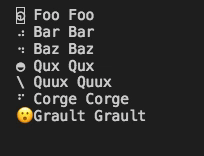

simple progressbar with golang   
```go

func main() {

	p1 := progressbar.New(progressbar.Spin2, 100)
	c1 := p1.Run()

	p2 := progressbar.New(progressbar.Box4, 200)
	c2 := p2.Run()

	p3 := progressbar.New(progressbar.Box5, 300)
	c3 := p3.Run()

	p4 := progressbar.New(progressbar.Spin4, 400)
	c4 := p4.Run()

	p5 := progressbar.New(progressbar.Spin1, 500)
	c5 := p5.Run()

	p6 := progressbar.New(progressbar.Box4, 100)
	c6 := p6.Run()

	p7 := progressbar.New(progressbar.Emoji, 200)
	c7 := p7.Run()

	for {
		select {
		case <-progressbar.Race(c1, c2, c3, c4, c5, c6, c7):
			fmt.Print(
				progressbar.PrintMultiText(
					p1.Print(" Foo Foo"),
					p2.Print(" Bar Bar"),
					p3.Print(" Baz Baz"),
					p4.Print(" Qux Qux"),
					p5.Print(" Quux Quux "),
					p6.Print(" Corge Corge"),
					p7.Print(" Grault Grault"),
				),
			)
		}
	}

}

```
